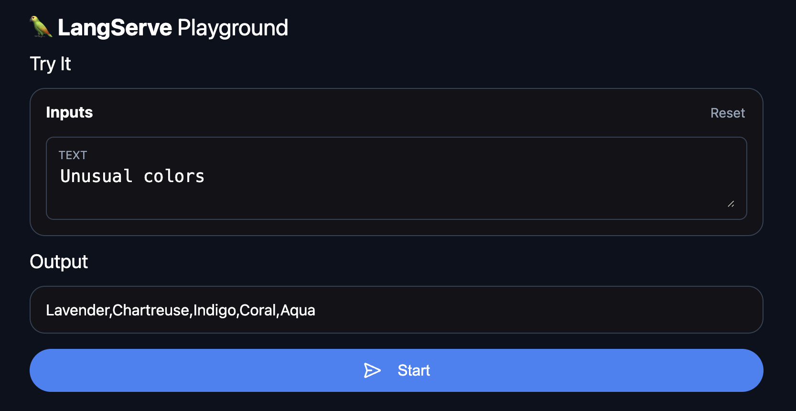

# 🦜️🏓 LangServe

This _unofficial_ LangChain server based on [Langserve](https://python.langchain.com/docs/langserve) is a work in progress. It is not yet ready for production use. Not all features are implemented

## Overview[​](#overview "Direct link to Overview")

`LangServe` helps developers deploy `LangChain` [runnables and chains](https://js.langchain.com/docs/expression_language/) as a REST API.

This library used express as a peer dependency to provide a server.

In addition, it provides a client that can be used to call into runnables deployed on a server. A javascript client is available in [LangChainJS](https://js.langchain.com/docs/api/runnables_remote/classes/RemoteRunnable).

## Features[​](#features "Direct link to Features")

object, and enforced on every API call, with rich error messages

- `/invoke/` endpoint with support for many concurrent requests on a single server
- Playground page at `/playground/` with streaming output and intermediate steps
- All built with battle-tested open-source JavaScript libraries like Express.
- Use the client SDK to call a LangServe server as if it was a Runnable running locally (or call the HTTP API directly)
- [LangServe Hub](https://github.com/langchain-ai/langchain/blob/master/templates/README.md)

### Limitations[​](#limitations "Direct link to Limitations")

- Client callbacks are not yet supported for events that originate on the server

## Security[​](#security "Direct link to Security")

## Installation[​](#installation "Direct link to Installation")

```shell
npm install langserve
```

## Examples[​](#examples "Direct link to Examples")

Get your LangServe instance started quickly with [LangChain Templates](https://github.com/langchain-ai/langchain/blob/master/templates/README.md).

For more examples, see the templates [index](https://github.com/langchain-ai/langchain/blob/master/templates/docs/INDEX.md) or the [examples](https://github.com/langchain-ai/langserve/tree/main/examples) directory.

### Server[​](#server "Direct link to Server")

Here's a server that deploys an OpenAI chat model, an Anthropic chat model, and a chain that uses the Anthropic model to tell a joke about a topic.

```typescript
import express from "express";
import { ChatPromptTemplate } from "langchain/prompts";
import { ChatAnthropic } from "langchain/chat_models/anthropic";
import { ChatOpenAI } from "langchain/chat_models/openai";
import { add_express_routes as add_routes } from "langserve";

const app = express();

add_routes(app, ChatOpenAI(), { path = "/openai" });
add_routes(app, ChatAnthropic(), { path: "/anthropic" });

const model = ChatAnthropic();
const prompt = ChatPromptTemplate.from_template("tell me a joke about {topic}");

add_routes(app, prompt.pipe(model), { path: "/joke", inputs: ["topic"] });

app.listen(8000);
```

### Client[​](#client "Direct link to Client")

Javascript SDK

```javascript
import { SystemMessage, HumanMessage } from "langchain/schema";
import { ChatPromptTemplate } from "langchain/prompts";
import { RunnableMap } from "langchain/schema/runnable";
import { RemoteRunnable } from "langserve";

const openai = new RemoteRunnable("http://localhost:8000/openai/");
const anthropic = new RemoteRunnable("http://localhost:8000/anthropic/");
const joke_chain = new RemoteRunnable("http://localhost:8000/joke/");

await joke_chain.ainvoke({ topic: "parrots" });

const prompt = [
  SystemMessage((content = "Act like either a cat or a parrot.")),
  HumanMessage((content = "Hello!")),
];

// Supports astream

for await (const msg of anthropic.astream(prompt)) {
  console.log(msg);
}

const prompt = ChatPromptTemplate.from_messages([
  ["system", "Tell me a long story about {topic}"],
]);

//  Can define custom chains

const chain = prompt.pipe(
  RunnableMap({
    openai: openai,
    anthropic: anthropic,
  })
);

chain.batch([{ topic: "parrots" }, { topic: "cats" }]);
```

In TypeScript (requires LangChain.js version 0.0.166 or later):

```javascript
import { RemoteRunnable } from "langchain/runnables/remote";

const chain = new RemoteRunnable({
  url: `http://localhost:8000/joke/`,
});
const result = await chain.invoke({
  topic: "cats",
});
```

Python using `requests`:

```python
import requests
response = requests.post(
    "http://localhost:8000/joke/invoke",
    json={'input': {'topic': 'cats'}}
)
response.json()
```

You can also use `curl`:

```shell
curl --location --request POST 'http://localhost:8000/joke/invoke' \
    --header 'Content-Type: application/json' \
    --data-raw '{
        "input": {
            "topic": "cats"
        }
    }'
```

## Endpoints[​](#endpoints "Direct link to Endpoints")

The following code:

    ...
    add_routes(
      app,
      runnable,
      path="/my_runnable",
    )

adds of these endpoints to the server:

- `POST /my_runnable/invoke` - invoke the runnable on a single input

These endpoints match the [LangChain Expression Language interface](https://python.langchain.com/docs/expression_language/interface) -- please reference this documentation for more details.

## Playground[​](#playground "Direct link to Playground")

You can find a playground page for your runnable at `/my_runnable/playground/`. This exposes a simple UI to [configure](https://python.langchain.com/docs/expression_language/how_to/configure) and invoke your runnable with streaming output and intermediate steps.


